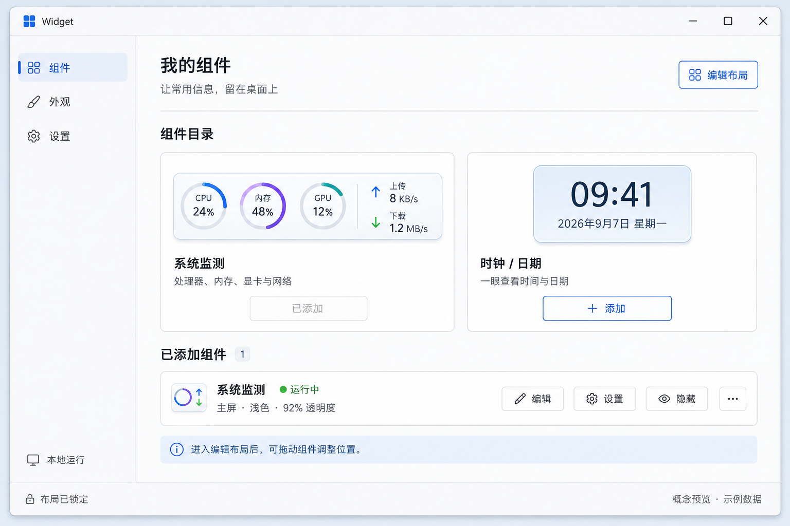

# Widget

Windows 本地桌面小组件，面向个人使用和 vibe coding 练手。项目基于 Electron + Node.js，支持开发运行和 portable 文件夹分发。它是持续试验中的自用项目，不是承诺固定维护周期或兼容范围的成熟商业产品。

仓库名是 `Widgets`，应用运行时仍叫 `Widget`，以保持现有配置、单实例和自启动身份兼容。

## 当前能力

- 系统监测：CPU、内存、GPU 三圆环，以及物理网卡上传/下载速率；资源 provider 不可用时显示安全的等待或不可用状态。
- 时钟 / 日期：本地时间、日期、24 小时 / 12 小时和秒数显示。
- 便签：一篇本地纯文本便签，支持标题、多行正文、自动保存、失败重试、尺寸和背景设置。
- 每日待办：本地记录当天任务，支持新增、勾选完成、进度显示；桌面上默认可直接交互，标题条可切换“交互中/已锁定”，锁定后可从系统托盘解锁；启动进入新日期时清空上一日任务，不提供历史记录、提醒或同步。
- Codex 额度：可选的本地 Codex app-server 读取，显示 5 小时/周窗口、已用比例和重置信息，不显示费用或凭据。
- 管理器：组件目录分页、紧凑实例列表分页、布局编辑、外观设置和自启动入口；目录与实例页数按实际数量和窗口容量计算。
- 托盘常驻：关闭管理器后可保留组件运行，并从托盘打开、隐藏/恢复组件或退出 Widget。
- 主屏桌面组件：正式运行尝试附着 Windows WorkerW 桌面层；每日待办使用普通透明浮动窗口以保证桌面直接输入，其他组件编辑布局时临时使用普通窗口，完成或取消后重新附着。

## 环境与范围

- Windows 11 x64，普通交互式桌面会话。
- Node.js `>=22.12.0` 和 npm。
- 当前只支持主屏，不承诺多屏、显示器热插拔、Explorer 重启、睡眠/锁屏恢复或其他未验证环境。
- Codex 额度是可选组件：本机没有可用的 `codex app-server` 时会降级为不可用状态。项目不把“使用本机进程”描述为全链路离线。

## 快速开始

在仓库根目录执行：

```powershell
npm.cmd ci
npm.cmd run manager
```

`npm.cmd` 可避开部分 Windows 执行策略对 `npm.ps1` 的限制。`npm.cmd start` 与 `npm.cmd run manager` 等价；无参数启动会打开 Widget 管理器。

## Portable 版本

生成 portable 文件夹：

```powershell
npm.cmd run package:portable
```

入口为 `dist/Widget-portable/Widget.exe`。运行时请保留整个 `Widget-portable` 文件夹，不要只复制 exe。portable 不提供安装器，适合个人直接复制使用；自启动只允许登记正式的 `Widget.exe` 成品路径。

## 验证

Node 回归测试：

```powershell
npm.cmd test
```

常用自动化 smoke：

```powershell
npm.cmd run smoke:manager
npm.cmd run smoke:manager-ui
npm.cmd run smoke:single-instance
npm.cmd run smoke:tray
npm.cmd run smoke:note
npm.cmd run smoke:todo
npm.cmd run smoke:codex-quota
npm.cmd run smoke:renderer-recovery
npm.cmd run smoke:autostart
npm.cmd run smoke:performance
npm.cmd run smoke:portable
```

`npm.cmd run smoke:desktop` 会尝试验证真实 WorkerW 层级，但仍不能替代可见桌面人工检查。M0 研究入口为 `npm.cmd run probe`，不等同于普通管理器启动。

## 设计参考



这张图是 AI 概念图，卡片内容是示例数据，不是实机截图，也不代表所有功能都已经验证。

## 当前限制

- 不包含安装器、云端同步、远程服务或多屏布局。
- 每日待办只保存本机当前日期的任务，不包含历史归档、提醒、重复任务或跨设备同步；交互锁定是运行时状态，不写入配置。
- WorkerW、GPU/网络性能计数器、托盘和当前用户自启动依赖 Windows 实际环境；每日待办的直接输入不依赖 WorkerW；开发版和自动化隔离配置不会修改真实自启动项。
- 每日待办在真实桌面上的锁定态点击穿透、托盘解锁、新增/勾选保存、跨午夜清空和长文本边界仍需要人工抽查；真实 Codex 登录读取、中文便签输入、编辑拖动、Explorer 重启、注销登录恢复以及 165% DPI 可读性也需要在普通桌面会话中人工抽查。
- 自动化测试和当前机器性能数据仅作为回归/基线证据，不是跨机器保证。

## 项目结构

```text
src/                       应用、管理器、组件、WorkerW 与 M0 探针源码
test/                      Node 自动化回归测试
tools/                     smoke、portable 和 M0 launcher 脚本
docs/design/               AI 概念图与设计参考
docs/development.md        架构入口、配置和开发命令
docs/status.md             当前能力、证据与人工验证清单
```

## 开发资料

- [`AGENTS.md`](AGENTS.md)：提交和范围约束。
- [`docs/development.md`](docs/development.md)：架构入口、运行配置、诊断与验证方式。
- [`docs/status.md`](docs/status.md)：本轮可复现证据和剩余人工事项。

## 许可证

项目使用根目录 [`LICENSE`](LICENSE) 中的 MIT 许可证。portable 成品会保留项目许可证，并保留 Electron 与 koffi 自带的许可证/声明文件（当前 koffi 包为 `LICENSE.txt`）。
